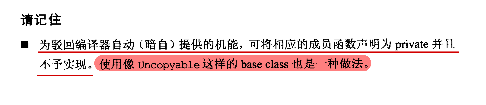

# Effective 笔记

## 条款2：尽量以const、enum、inline替换#define

## 条款3：尽可能使用const

## 条款4：确定对象被使用前已先被初始化

==利用仿真函数，返回一个引用指向定义的一个对象==

## 条款5：了解C++ 默默编写并调用那些函数

## 条款6：若不想使用编译器自动生成的函数，就应该明确拒绝

## 条款7：为多态基类声明virtual析构函数

## 条款8：别让异常逃离析构函数

## 条款9:决不在构造和析构过程中调用virtual函数

## 条款10：令operator= 返回一个reference to *this

## 条款11：在operator= 中处理“自我复制”

## 条款12：复制对象时勿忘其每一个成分

## 条款13：以对象管理资源

1、把资源放进对象内、便可依赖C++的析构函数自动调用机制，确保资源被释放

其中两个关键想法：

- 获得资源后立刻放进管理对象
- 管理对象运用析构函数后确保资源被释放

## **条款14：在资源管理类中新校coping行为**

## 条款15：在资源管理类中提供对原始资源的访问

## 条款16：成对使用new和delete时要采用相同形式

## 条款17：以独立语句将newed对象置入智能指针

## 条款18：让接口容易被正确使用，不易被误用

## 条款19：设计class犹如设计type

